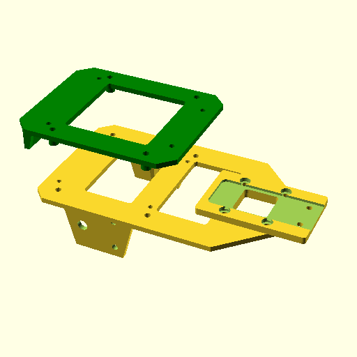

# LiDAR Bot

I received an [OpenBot](https://www.openbot.org/) and wanted to play with navigation algorithms without using a phone. While the openbot enables a fast first run, you soon run into its limits. This project is about building a chassis that can mount various components into a working sensor-driven robot. 

Three pieces for mounting various components:

1. **Motor mount:** main component mounts two TT motors, a Raspberry Pi with attached battery pack (UPS Hat), and a caster wheel. 
1. **Controller mount:** A mount to connect the Atom Motion Base to the main piece using the same screws that attach caster. 
1. **Sensor mount:** A mount for the Intel RealSense (using two screws on its back) and the Slamtec RPLiDAR A1M8. 

The design is biased towards 

1. Shorter print times that don't need post-processing 
1. Ability to change what sensors or controller board is attached without unmounting the motor from existing mount

## For printing

The main file is `main_chassis.scad`

Change the `assembly` parameter to `false` in `main_chassis.scad`. 

## Improvements needed
1. One spacer that connects the sensor mount to the motor mount blocked the USB Micro-B port for charging the UPS. The spacer hole pattern could be modified. 
1. The spacers and heavy sensors together act like a sprung mass that oscillates. More spacers or material could help. 
<!-- 1. The AtomMotionBase was helpful for rapidly getting to a powered chassis. However, its electrical connections aren't compatible with also connecting the ESP32 module to a powered Raspberry Pi by USB. Also, the battery life is short. A separate motor driver (like the DRV8833) and larger battery pack (for motors) are needed. --> 
